<!--
title: "👋 HI, I'M TANNER GOLDEN"
description: "Profile README for @tannergolden: what I work on, the developer news this page posts by itself, how the repositories fit together, and how long the things I build on have left."
tags: [profile, ai-research, systems-engineering, automation]
category: profile
-->

<!-- markdownlint-disable MD041 -->

<div align="center">

<a name="top"></a>

<!-- MASTHEAD:BEGIN -->
<picture>
  <source media="(max-width: 498px)" srcset="assets/masthead-blank.svg?v=a2358fd2">
  <source media="(prefers-reduced-motion: reduce) and (prefers-color-scheme: dark)" srcset="assets/masthead-still-dark.svg?v=e929f92a">
  <source media="(prefers-reduced-motion: reduce)" srcset="assets/masthead-still-light.svg?v=7eaeae07">
  <source media="(prefers-color-scheme: dark)" srcset="assets/masthead-dark.svg?v=9fdac2a7">
  
</picture>
<!-- MASTHEAD:END -->

[](./)
[](./)
[](./)
[](./LICENSE)

<!-- AVAILABILITY:BEGIN -->
[](./)
<!-- AVAILABILITY:END -->

</div>

---

## 💡 About

---

## 📡 Dispatch

<!-- DISPATCHES:BEGIN -->
### Wednesday, September 23, 2026

[](https://github.com/tannergolden/tannergolden/actions/workflows/dispatches.yml) [](dispatches/2026/September.md)

| Time | Commit | Dispatch |
| :--- | :--- | :--- |
| 21:07 | `docs(npr)` | [Understanding Jensen Huang's AI optimism and how it influences President Trump](dispatches/2026/September.md#dispatch-20260923-210732) |
| 18:05 | `docs(lobsters)` | [Abandoning Scientific Linux Was a Mistake](dispatches/2026/September.md#dispatch-20260923-180518) |
| 05:35 | `feat(node)` | [Node.js 26.10.0 (Current)](dispatches/2026/September.md#dispatch-20260923-053543) |

[All dispatches](dispatches/) · [How it works](How-It-Works.md) · 3 in September
<!-- DISPATCHES:END -->

<!-- MODULES:BEGIN -->
> [!TIP]
> **brew leaves** · List installed formulas that are not dependencies of another installed formula or cask. · [tldr](https://github.com/tldr-pages/tldr/blob/main/pages/common/brew-leaves.md)
>
> Only list leaves that were installed as dependencies:
>
> ```bash
> brew leaves --installed-as-dependency
> ```
<!-- MODULES:END -->

---

## 🏆 Trophies

What this account has earned, measured every night by
[`tannergolden/trophies`](https://github.com/tannergolden/trophies) and drawn
as committed images: eight tiered trophies, a level card, and one hundred
achievements in the dropdown. This page is the live example of its
**profile mode**; the repository's own README shows **repository mode**.
Click any card to read what it is for and how it is earned.

<!-- trophies:start -->

<p align="center">
  <picture><source media="(prefers-color-scheme: dark)" srcset="assets/trophies/level.svg"></picture>
  <picture><source media="(prefers-color-scheme: dark)" srcset="assets/trophies/next-up.svg">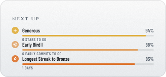</picture>
</p>

<p align="center">
  <a href="https://github.com/tannergolden/trophies/blob/HEAD/docs/Catalogue.md#profile-commits"><picture><source media="(prefers-color-scheme: dark)" srcset="assets/trophies/commits.svg"></picture></a>
  <a href="https://github.com/tannergolden/trophies/blob/HEAD/docs/Catalogue.md#profile-pulls"><picture><source media="(prefers-color-scheme: dark)" srcset="assets/trophies/pulls.svg">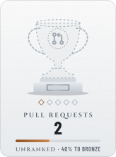</picture></a>
  <a href="https://github.com/tannergolden/trophies/blob/HEAD/docs/Catalogue.md#profile-reviews"><picture><source media="(prefers-color-scheme: dark)" srcset="assets/trophies/reviews.svg"></picture></a>
  <a href="https://github.com/tannergolden/trophies/blob/HEAD/docs/Catalogue.md#profile-issues"><picture><source media="(prefers-color-scheme: dark)" srcset="assets/trophies/issues.svg">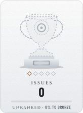</picture></a>
  <a href="https://github.com/tannergolden/trophies/blob/HEAD/docs/Catalogue.md#profile-stars"><picture><source media="(prefers-color-scheme: dark)" srcset="assets/trophies/stars.svg">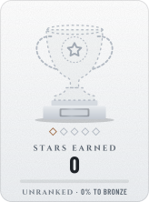</picture></a>
  <a href="https://github.com/tannergolden/trophies/blob/HEAD/docs/Catalogue.md#profile-followers"><picture><source media="(prefers-color-scheme: dark)" srcset="assets/trophies/followers.svg"></picture></a>
  <a href="https://github.com/tannergolden/trophies/blob/HEAD/docs/Catalogue.md#profile-streak"><picture><source media="(prefers-color-scheme: dark)" srcset="assets/trophies/streak.svg"></picture></a>
  <a href="https://github.com/tannergolden/trophies/blob/HEAD/docs/Catalogue.md#profile-repos"><picture><source media="(prefers-color-scheme: dark)" srcset="assets/trophies/repos.svg"></picture></a>
</p>

<details>
<summary><b>Achievements</b> · 40 of 104 earned · next: Early Bird I, 94%</summary>

<p align="center"><b>Milestones</b></p>
<p align="center">
  <a href="https://github.com/tannergolden/trophies/blob/HEAD/docs/Catalogue.md#profile-century"><picture><source media="(prefers-color-scheme: dark)" srcset="assets/trophies/achievements/century.svg"></picture></a>
  <a href="https://github.com/tannergolden/trophies/blob/HEAD/docs/Catalogue.md#profile-landed"><picture><source media="(prefers-color-scheme: dark)" srcset="assets/trophies/achievements/landed.svg"></picture></a>
  <a href="https://github.com/tannergolden/trophies/blob/HEAD/docs/Catalogue.md#profile-shipped"><picture><source media="(prefers-color-scheme: dark)" srcset="assets/trophies/achievements/shipped.svg">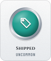</picture></a>
  <a href="https://github.com/tannergolden/trophies/blob/HEAD/docs/Catalogue.md#profile-first-light"><picture><source media="(prefers-color-scheme: dark)" srcset="assets/trophies/achievements/first-light.svg">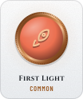</picture></a>
  <a href="https://github.com/tannergolden/trophies/blob/HEAD/docs/Catalogue.md#profile-hello-world"><picture><source media="(prefers-color-scheme: dark)" srcset="assets/trophies/achievements/hello-world.svg">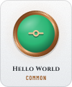</picture></a>
  <a href="https://github.com/tannergolden/trophies/blob/HEAD/docs/Catalogue.md#profile-opening-move"><picture><source media="(prefers-color-scheme: dark)" srcset="assets/trophies/achievements/opening-move.svg">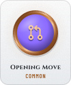</picture></a>
  <a href="https://github.com/tannergolden/trophies/blob/HEAD/docs/Catalogue.md#profile-veteran"><picture><source media="(prefers-color-scheme: dark)" srcset="assets/trophies/achievements/veteran.svg"></picture></a>
  <a href="https://github.com/tannergolden/trophies/blob/HEAD/docs/Catalogue.md#profile-polyglot"><picture><source media="(prefers-color-scheme: dark)" srcset="assets/trophies/achievements/polyglot.svg">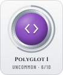</picture></a>
  <a href="https://github.com/tannergolden/trophies/blob/HEAD/docs/Catalogue.md#profile-branching-out"><picture><source media="(prefers-color-scheme: dark)" srcset="assets/trophies/achievements/branching-out.svg"></picture></a>
  <a href="https://github.com/tannergolden/trophies/blob/HEAD/docs/Catalogue.md#profile-shipwright"><picture><source media="(prefers-color-scheme: dark)" srcset="assets/trophies/achievements/shipwright.svg">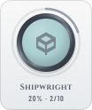</picture></a>
  <a href="https://github.com/tannergolden/trophies/blob/HEAD/docs/Catalogue.md#profile-monolith"><picture><source media="(prefers-color-scheme: dark)" srcset="assets/trophies/achievements/monolith.svg">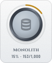</picture></a>
  <a href="https://github.com/tannergolden/trophies/blob/HEAD/docs/Catalogue.md#profile-bug-hunter"><picture><source media="(prefers-color-scheme: dark)" srcset="assets/trophies/achievements/bug-hunter.svg">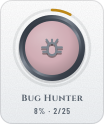</picture></a>
  <a href="https://github.com/tannergolden/trophies/blob/HEAD/docs/Catalogue.md#profile-merge-master"><picture><source media="(prefers-color-scheme: dark)" srcset="assets/trophies/achievements/merge-master.svg"></picture></a>
  <a href="https://github.com/tannergolden/trophies/blob/HEAD/docs/Catalogue.md#profile-closer"><picture><source media="(prefers-color-scheme: dark)" srcset="assets/trophies/achievements/closer.svg">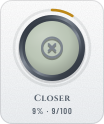</picture></a>
  <a href="https://github.com/tannergolden/trophies/blob/HEAD/docs/Catalogue.md#profile-fan-club"><picture><source media="(prefers-color-scheme: dark)" srcset="assets/trophies/achievements/fan-club.svg"></picture></a>
  <a href="https://github.com/tannergolden/trophies/blob/HEAD/docs/Catalogue.md#profile-forked"><picture><source media="(prefers-color-scheme: dark)" srcset="assets/trophies/achievements/forked.svg">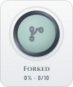</picture></a>
  <a href="https://github.com/tannergolden/trophies/blob/HEAD/docs/Catalogue.md#profile-long-haul"><picture><source media="(prefers-color-scheme: dark)" srcset="assets/trophies/achievements/long-haul.svg">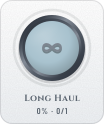</picture></a>
  <a href="https://github.com/tannergolden/trophies/blob/HEAD/docs/Catalogue.md#profile-second-opinion"><picture><source media="(prefers-color-scheme: dark)" srcset="assets/trophies/achievements/second-opinion.svg"></picture></a>
  <a href="https://github.com/tannergolden/trophies/blob/HEAD/docs/Catalogue.md#profile-stargazer"><picture><source media="(prefers-color-scheme: dark)" srcset="assets/trophies/achievements/stargazer.svg">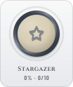</picture></a>
  <a href="https://github.com/tannergolden/trophies/blob/HEAD/docs/Catalogue.md#profile-ticket"><picture><source media="(prefers-color-scheme: dark)" srcset="assets/trophies/achievements/ticket.svg"></picture></a>
  <a href="https://github.com/tannergolden/trophies/blob/HEAD/docs/Catalogue.md#profile-watched"><picture><source media="(prefers-color-scheme: dark)" srcset="assets/trophies/achievements/watched.svg"></picture></a>
</p>

<p align="center"><b>Craft</b></p>
<p align="center">
  <a href="https://github.com/tannergolden/trophies/blob/HEAD/docs/Catalogue.md#profile-by-the-book"><picture><source media="(prefers-color-scheme: dark)" srcset="assets/trophies/achievements/by-the-book.svg"></picture></a>
  <a href="https://github.com/tannergolden/trophies/blob/HEAD/docs/Catalogue.md#profile-duet"><picture><source media="(prefers-color-scheme: dark)" srcset="assets/trophies/achievements/duet.svg"></picture></a>
  <a href="https://github.com/tannergolden/trophies/blob/HEAD/docs/Catalogue.md#profile-green-machine"><picture><source media="(prefers-color-scheme: dark)" srcset="assets/trophies/achievements/green-machine.svg">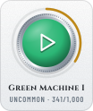</picture></a>
  <a href="https://github.com/tannergolden/trophies/blob/HEAD/docs/Catalogue.md#profile-scribe"><picture><source media="(prefers-color-scheme: dark)" srcset="assets/trophies/achievements/scribe.svg"></picture></a>
  <a href="https://github.com/tannergolden/trophies/blob/HEAD/docs/Catalogue.md#profile-signed"><picture><source media="(prefers-color-scheme: dark)" srcset="assets/trophies/achievements/signed.svg"></picture></a>
  <a href="https://github.com/tannergolden/trophies/blob/HEAD/docs/Catalogue.md#profile-toolsmith"><picture><source media="(prefers-color-scheme: dark)" srcset="assets/trophies/achievements/toolsmith.svg"></picture></a>
  <a href="https://github.com/tannergolden/trophies/blob/HEAD/docs/Catalogue.md#profile-fixer"><picture><source media="(prefers-color-scheme: dark)" srcset="assets/trophies/achievements/fixer.svg"></picture></a>
  <a href="https://github.com/tannergolden/trophies/blob/HEAD/docs/Catalogue.md#profile-surgeon"><picture><source media="(prefers-color-scheme: dark)" srcset="assets/trophies/achievements/surgeon.svg"></picture></a>
  <a href="https://github.com/tannergolden/trophies/blob/HEAD/docs/Catalogue.md#profile-sweeping-change"><picture><source media="(prefers-color-scheme: dark)" srcset="assets/trophies/achievements/sweeping-change.svg"></picture></a>
  <a href="https://github.com/tannergolden/trophies/blob/HEAD/docs/Catalogue.md#profile-heavy-lifter"><picture><source media="(prefers-color-scheme: dark)" srcset="assets/trophies/achievements/heavy-lifter.svg"></picture></a>
  <a href="https://github.com/tannergolden/trophies/blob/HEAD/docs/Catalogue.md#profile-tested"><picture><source media="(prefers-color-scheme: dark)" srcset="assets/trophies/achievements/tested.svg">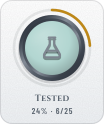</picture></a>
  <a href="https://github.com/tannergolden/trophies/blob/HEAD/docs/Catalogue.md#profile-well-maintained"><picture><source media="(prefers-color-scheme: dark)" srcset="assets/trophies/achievements/well-maintained.svg">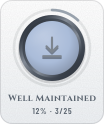</picture></a>
  <a href="https://github.com/tannergolden/trophies/blob/HEAD/docs/Catalogue.md#profile-gitmoji"><picture><source media="(prefers-color-scheme: dark)" srcset="assets/trophies/achievements/gitmoji.svg">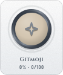</picture></a>
  <a href="https://github.com/tannergolden/trophies/blob/HEAD/docs/Catalogue.md#profile-undo"><picture><source media="(prefers-color-scheme: dark)" srcset="assets/trophies/achievements/undo.svg"></picture></a>
</p>

<p align="center"><b>Rhythm</b></p>
<p align="center">
  <a href="https://github.com/tannergolden/trophies/blob/HEAD/docs/Catalogue.md#profile-marathon-day"><picture><source media="(prefers-color-scheme: dark)" srcset="assets/trophies/achievements/marathon-day.svg"></picture></a>
  <a href="https://github.com/tannergolden/trophies/blob/HEAD/docs/Catalogue.md#profile-sprint"><picture><source media="(prefers-color-scheme: dark)" srcset="assets/trophies/achievements/sprint.svg"></picture></a>
  <a href="https://github.com/tannergolden/trophies/blob/HEAD/docs/Catalogue.md#profile-big-week"><picture><source media="(prefers-color-scheme: dark)" srcset="assets/trophies/achievements/big-week.svg"></picture></a>
  <a href="https://github.com/tannergolden/trophies/blob/HEAD/docs/Catalogue.md#profile-night-owl"><picture><source media="(prefers-color-scheme: dark)" srcset="assets/trophies/achievements/night-owl.svg">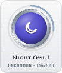</picture></a>
  <a href="https://github.com/tannergolden/trophies/blob/HEAD/docs/Catalogue.md#profile-comeback"><picture><source media="(prefers-color-scheme: dark)" srcset="assets/trophies/achievements/comeback.svg"></picture></a>
  <a href="https://github.com/tannergolden/trophies/blob/HEAD/docs/Catalogue.md#profile-early-bird"><picture><source media="(prefers-color-scheme: dark)" srcset="assets/trophies/achievements/early-bird.svg">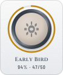</picture></a>
  <a href="https://github.com/tannergolden/trophies/blob/HEAD/docs/Catalogue.md#profile-long-game"><picture><source media="(prefers-color-scheme: dark)" srcset="assets/trophies/achievements/long-game.svg">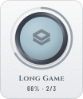</picture></a>
  <a href="https://github.com/tannergolden/trophies/blob/HEAD/docs/Catalogue.md#profile-lunch-break"><picture><source media="(prefers-color-scheme: dark)" srcset="assets/trophies/achievements/lunch-break.svg">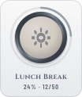</picture></a>
  <a href="https://github.com/tannergolden/trophies/blob/HEAD/docs/Catalogue.md#profile-weekender"><picture><source media="(prefers-color-scheme: dark)" srcset="assets/trophies/achievements/weekender.svg">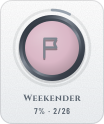</picture></a>
  <a href="https://github.com/tannergolden/trophies/blob/HEAD/docs/Catalogue.md#profile-weekday-warrior"><picture><source media="(prefers-color-scheme: dark)" srcset="assets/trophies/achievements/weekday-warrior.svg">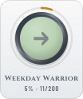</picture></a>
  <a href="https://github.com/tannergolden/trophies/blob/HEAD/docs/Catalogue.md#profile-year-of-code"><picture><source media="(prefers-color-scheme: dark)" srcset="assets/trophies/achievements/year-of-code.svg">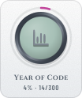</picture></a>
  <a href="https://github.com/tannergolden/trophies/blob/HEAD/docs/Catalogue.md#profile-four-seasons"><picture><source media="(prefers-color-scheme: dark)" srcset="assets/trophies/achievements/four-seasons.svg">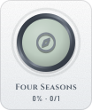</picture></a>
  <a href="https://github.com/tannergolden/trophies/blob/HEAD/docs/Catalogue.md#profile-friday-deploy"><picture><source media="(prefers-color-scheme: dark)" srcset="assets/trophies/achievements/friday-deploy.svg">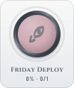</picture></a>
  <a href="https://github.com/tannergolden/trophies/blob/HEAD/docs/Catalogue.md#profile-perfect-month"><picture><source media="(prefers-color-scheme: dark)" srcset="assets/trophies/achievements/perfect-month.svg"></picture></a>
</p>

<p align="center"><b>Community</b></p>
<p align="center">
  <a href="https://github.com/tannergolden/trophies/blob/HEAD/docs/Catalogue.md#profile-introduced"><picture><source media="(prefers-color-scheme: dark)" srcset="assets/trophies/achievements/introduced.svg">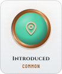</picture></a>
  <a href="https://github.com/tannergolden/trophies/blob/HEAD/docs/Catalogue.md#profile-open-door"><picture><source media="(prefers-color-scheme: dark)" srcset="assets/trophies/achievements/open-door.svg"></picture></a>
  <a href="https://github.com/tannergolden/trophies/blob/HEAD/docs/Catalogue.md#profile-generous"><picture><source media="(prefers-color-scheme: dark)" srcset="assets/trophies/achievements/generous.svg">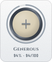</picture></a>
  <a href="https://github.com/tannergolden/trophies/blob/HEAD/docs/Catalogue.md#profile-curious"><picture><source media="(prefers-color-scheme: dark)" srcset="assets/trophies/achievements/curious.svg"></picture></a>
  <a href="https://github.com/tannergolden/trophies/blob/HEAD/docs/Catalogue.md#profile-answer-key"><picture><source media="(prefers-color-scheme: dark)" srcset="assets/trophies/achievements/answer-key.svg"></picture></a>
  <a href="https://github.com/tannergolden/trophies/blob/HEAD/docs/Catalogue.md#profile-backed"><picture><source media="(prefers-color-scheme: dark)" srcset="assets/trophies/achievements/backed.svg"></picture></a>
  <a href="https://github.com/tannergolden/trophies/blob/HEAD/docs/Catalogue.md#profile-conversation-starter"><picture><source media="(prefers-color-scheme: dark)" srcset="assets/trophies/achievements/conversation-starter.svg"></picture></a>
  <a href="https://github.com/tannergolden/trophies/blob/HEAD/docs/Catalogue.md#profile-crew"><picture><source media="(prefers-color-scheme: dark)" srcset="assets/trophies/achievements/crew.svg">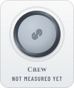</picture></a>
  <a href="https://github.com/tannergolden/trophies/blob/HEAD/docs/Catalogue.md#profile-founder"><picture><source media="(prefers-color-scheme: dark)" srcset="assets/trophies/achievements/founder.svg"></picture></a>
  <a href="https://github.com/tannergolden/trophies/blob/HEAD/docs/Catalogue.md#profile-gist-keeper"><picture><source media="(prefers-color-scheme: dark)" srcset="assets/trophies/achievements/gist-keeper.svg">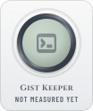</picture></a>
  <a href="https://github.com/tannergolden/trophies/blob/HEAD/docs/Catalogue.md#profile-green-light"><picture><source media="(prefers-color-scheme: dark)" srcset="assets/trophies/achievements/green-light.svg">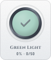</picture></a>
  <a href="https://github.com/tannergolden/trophies/blob/HEAD/docs/Catalogue.md#profile-patron"><picture><source media="(prefers-color-scheme: dark)" srcset="assets/trophies/achievements/patron.svg"></picture></a>
  <a href="https://github.com/tannergolden/trophies/blob/HEAD/docs/Catalogue.md#profile-planner"><picture><source media="(prefers-color-scheme: dark)" srcset="assets/trophies/achievements/planner.svg"></picture></a>
  <a href="https://github.com/tannergolden/trophies/blob/HEAD/docs/Catalogue.md#profile-red-pen"><picture><source media="(prefers-color-scheme: dark)" srcset="assets/trophies/achievements/red-pen.svg">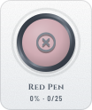</picture></a>
  <a href="https://github.com/tannergolden/trophies/blob/HEAD/docs/Catalogue.md#profile-registry"><picture><source media="(prefers-color-scheme: dark)" srcset="assets/trophies/achievements/registry.svg"></picture></a>
  <a href="https://github.com/tannergolden/trophies/blob/HEAD/docs/Catalogue.md#profile-reporter"><picture><source media="(prefers-color-scheme: dark)" srcset="assets/trophies/achievements/reporter.svg"></picture></a>
  <a href="https://github.com/tannergolden/trophies/blob/HEAD/docs/Catalogue.md#profile-roundtable"><picture><source media="(prefers-color-scheme: dark)" srcset="assets/trophies/achievements/roundtable.svg"></picture></a>
  <a href="https://github.com/tannergolden/trophies/blob/HEAD/docs/Catalogue.md#profile-second-pair-of-eyes"><picture><source media="(prefers-color-scheme: dark)" srcset="assets/trophies/achievements/second-pair-of-eyes.svg"></picture></a>
  <a href="https://github.com/tannergolden/trophies/blob/HEAD/docs/Catalogue.md#profile-team-player"><picture><source media="(prefers-color-scheme: dark)" srcset="assets/trophies/achievements/team-player.svg"></picture></a>
  <a href="https://github.com/tannergolden/trophies/blob/HEAD/docs/Catalogue.md#profile-upstream"><picture><source media="(prefers-color-scheme: dark)" srcset="assets/trophies/achievements/upstream.svg"></picture></a>
  <a href="https://github.com/tannergolden/trophies/blob/HEAD/docs/Catalogue.md#profile-voice"><picture><source media="(prefers-color-scheme: dark)" srcset="assets/trophies/achievements/voice.svg"></picture></a>
</p>

<p align="center"><b>Housekeeping</b></p>
<p align="center">
  <a href="https://github.com/tannergolden/trophies/blob/HEAD/docs/Catalogue.md#profile-locksmith"><picture><source media="(prefers-color-scheme: dark)" srcset="assets/trophies/achievements/locksmith.svg"></picture></a>
  <a href="https://github.com/tannergolden/trophies/blob/HEAD/docs/Catalogue.md#profile-auto-pilot"><picture><source media="(prefers-color-scheme: dark)" srcset="assets/trophies/achievements/auto-pilot.svg"></picture></a>
  <a href="https://github.com/tannergolden/trophies/blob/HEAD/docs/Catalogue.md#profile-blueprint"><picture><source media="(prefers-color-scheme: dark)" srcset="assets/trophies/achievements/blueprint.svg"></picture></a>
  <a href="https://github.com/tannergolden/trophies/blob/HEAD/docs/Catalogue.md#profile-form-filler"><picture><source media="(prefers-color-scheme: dark)" srcset="assets/trophies/achievements/form-filler.svg"></picture></a>
  <a href="https://github.com/tannergolden/trophies/blob/HEAD/docs/Catalogue.md#profile-house-rules"><picture><source media="(prefers-color-scheme: dark)" srcset="assets/trophies/achievements/house-rules.svg"></picture></a>
  <a href="https://github.com/tannergolden/trophies/blob/HEAD/docs/Catalogue.md#profile-label-maker"><picture><source media="(prefers-color-scheme: dark)" srcset="assets/trophies/achievements/label-maker.svg"></picture></a>
  <a href="https://github.com/tannergolden/trophies/blob/HEAD/docs/Catalogue.md#profile-town-hall"><picture><source media="(prefers-color-scheme: dark)" srcset="assets/trophies/achievements/town-hall.svg"></picture></a>
  <a href="https://github.com/tannergolden/trophies/blob/HEAD/docs/Catalogue.md#profile-welcome-mat"><picture><source media="(prefers-color-scheme: dark)" srcset="assets/trophies/achievements/welcome-mat.svg"></picture></a>
  <a href="https://github.com/tannergolden/trophies/blob/HEAD/docs/Catalogue.md#profile-curator"><picture><source media="(prefers-color-scheme: dark)" srcset="assets/trophies/achievements/curator.svg"></picture></a>
  <a href="https://github.com/tannergolden/trophies/blob/HEAD/docs/Catalogue.md#profile-documented"><picture><source media="(prefers-color-scheme: dark)" srcset="assets/trophies/achievements/documented.svg"></picture></a>
  <a href="https://github.com/tannergolden/trophies/blob/HEAD/docs/Catalogue.md#profile-licensed"><picture><source media="(prefers-color-scheme: dark)" srcset="assets/trophies/achievements/licensed.svg"></picture></a>
  <a href="https://github.com/tannergolden/trophies/blob/HEAD/docs/Catalogue.md#profile-gatekeeper"><picture><source media="(prefers-color-scheme: dark)" srcset="assets/trophies/achievements/gatekeeper.svg"></picture></a>
  <a href="https://github.com/tannergolden/trophies/blob/HEAD/docs/Catalogue.md#profile-semver"><picture><source media="(prefers-color-scheme: dark)" srcset="assets/trophies/achievements/semver.svg"></picture></a>
  <a href="https://github.com/tannergolden/trophies/blob/HEAD/docs/Catalogue.md#profile-front-door"><picture><source media="(prefers-color-scheme: dark)" srcset="assets/trophies/achievements/front-door.svg"></picture></a>
  <a href="https://github.com/tannergolden/trophies/blob/HEAD/docs/Catalogue.md#profile-open-hand"><picture><source media="(prefers-color-scheme: dark)" srcset="assets/trophies/achievements/open-hand.svg"></picture></a>
  <a href="https://github.com/tannergolden/trophies/blob/HEAD/docs/Catalogue.md#profile-packager"><picture><source media="(prefers-color-scheme: dark)" srcset="assets/trophies/achievements/packager.svg"></picture></a>
  <a href="https://github.com/tannergolden/trophies/blob/HEAD/docs/Catalogue.md#profile-roadmap"><picture><source media="(prefers-color-scheme: dark)" srcset="assets/trophies/achievements/roadmap.svg"></picture></a>
  <a href="https://github.com/tannergolden/trophies/blob/HEAD/docs/Catalogue.md#profile-tidy"><picture><source media="(prefers-color-scheme: dark)" srcset="assets/trophies/achievements/tidy.svg"></picture></a>
</p>

<p align="center"><b>Secret</b></p>
<p align="center">
  <a href="https://github.com/tannergolden/trophies/blob/HEAD/docs/Catalogue.md#profile-ghost"><picture><source media="(prefers-color-scheme: dark)" srcset="assets/trophies/achievements/ghost.svg"></picture></a>
  <a href="https://github.com/tannergolden/trophies/blob/HEAD/docs/Catalogue.md#profile-constellation"><picture><source media="(prefers-color-scheme: dark)" srcset="assets/trophies/achievements/constellation.svg"></picture></a>
  <a href="https://github.com/tannergolden/trophies/blob/HEAD/docs/Catalogue.md#profile-friday-the-13th"><picture><source media="(prefers-color-scheme: dark)" srcset="assets/trophies/achievements/friday-the-13th.svg"></picture></a>
  <a href="https://github.com/tannergolden/trophies/blob/HEAD/docs/Catalogue.md#profile-full-house"><picture><source media="(prefers-color-scheme: dark)" srcset="assets/trophies/achievements/full-house.svg"></picture></a>
  <a href="https://github.com/tannergolden/trophies/blob/HEAD/docs/Catalogue.md#profile-green-wall"><picture><source media="(prefers-color-scheme: dark)" srcset="assets/trophies/achievements/green-wall.svg"></picture></a>
  <a href="https://github.com/tannergolden/trophies/blob/HEAD/docs/Catalogue.md#profile-homecoming"><picture><source media="(prefers-color-scheme: dark)" srcset="assets/trophies/achievements/homecoming.svg"></picture></a>
  <a href="https://github.com/tannergolden/trophies/blob/HEAD/docs/Catalogue.md#profile-inbox-zero"><picture><source media="(prefers-color-scheme: dark)" srcset="assets/trophies/achievements/inbox-zero.svg"></picture></a>
  <a href="https://github.com/tannergolden/trophies/blob/HEAD/docs/Catalogue.md#profile-leap-day"><picture><source media="(prefers-color-scheme: dark)" srcset="assets/trophies/achievements/leap-day.svg"></picture></a>
  <a href="https://github.com/tannergolden/trophies/blob/HEAD/docs/Catalogue.md#profile-midnight-oil"><picture><source media="(prefers-color-scheme: dark)" srcset="assets/trophies/achievements/midnight-oil.svg"></picture></a>
  <a href="https://github.com/tannergolden/trophies/blob/HEAD/docs/Catalogue.md#profile-new-year"><picture><source media="(prefers-color-scheme: dark)" srcset="assets/trophies/achievements/new-year.svg"></picture></a>
  <a href="https://github.com/tannergolden/trophies/blob/HEAD/docs/Catalogue.md#profile-round-number"><picture><source media="(prefers-color-scheme: dark)" srcset="assets/trophies/achievements/round-number.svg"></picture></a>
  <a href="https://github.com/tannergolden/trophies/blob/HEAD/docs/Catalogue.md#profile-the-answer"><picture><source media="(prefers-color-scheme: dark)" srcset="assets/trophies/achievements/the-answer.svg"></picture></a>
</p>

<p align="center"><b>Maker</b></p>
<p align="center">
  <a href="https://github.com/tannergolden/trophies/blob/HEAD/docs/Catalogue.md#profile-badge-maker"><picture><source media="(prefers-color-scheme: dark)" srcset="assets/trophies/achievements/badge-maker.svg"></picture></a>
  <a href="https://github.com/tannergolden/trophies/blob/HEAD/docs/Catalogue.md#profile-pathfinder"><picture><source media="(prefers-color-scheme: dark)" srcset="assets/trophies/achievements/pathfinder.svg"></picture></a>
  <a href="https://github.com/tannergolden/trophies/blob/HEAD/docs/Catalogue.md#profile-standard-bearer"><picture><source media="(prefers-color-scheme: dark)" srcset="assets/trophies/achievements/standard-bearer.svg"></picture></a>
  <a href="https://github.com/tannergolden/trophies/blob/HEAD/docs/Catalogue.md#profile-trophy-maker"><picture><source media="(prefers-color-scheme: dark)" srcset="assets/trophies/achievements/trophy-maker.svg"></picture></a>
</p>

</details>

<p align="center"><sub>Refreshed daily by <a href="https://github.com/tannergolden/trophies">tannergolden/trophies</a> · Every trophy and achievement, what it is for and how to earn it: <a href="https://github.com/tannergolden/trophies/blob/HEAD/docs/Catalogue.md#profile">the catalogue</a>. Click any card for its entry.</sub></p>
<!-- trophies:end -->

---

## 📦 Repositories

| Repository                                                     | What it is                                                                            |
| :------------------------------------------------------------- | :------------------------------------------------------------------------------------ |
| [`standards`](https://github.com/tannergolden/standards)       | Reusable workflows and the documented standards they enforce                          |
| [`path`](https://github.com/tannergolden/path)                 | Repository template: structure, health files and wiring, already decided              |
| [`intelligence`](https://github.com/tannergolden/intelligence) | Agent instructions, published once and pinned rather than pasted into each repository |
| [`emblems`](https://github.com/tannergolden/emblems)           | Badges a repository draws for itself, so no README depends on an image service        |
| [`trophies`](https://github.com/tannergolden/trophies)         | Trophies a profile or repository earns for itself, measured nightly, never fetched    |
| [`.github`](https://github.com/tannergolden/.github)           | Default community health files for repositories that do not ship their own            |
| [`dotfiles`](https://github.com/tannergolden/dotfiles)         | Shell, editor, and toolchain configuration, installed the same way everywhere         |
| [`tannergolden`](https://github.com/tannergolden/tannergolden) | This file, and the workflow that keeps it current                                     |

---

## 🧰 Stack

| Area           | Tools                                                                                                                                                                                                                                          |
| :------------- | :--------------------------------------------------------------------------------------------------------------------------------------------------------------------------------------------------------------------------------------------- |
| **Languages**  |                                                                                        |
| **Tooling**    |      |
| **Operations** |                                   |

---

## ⏳ Support Clock

<!-- SUPPORT:BEGIN -->
| Runtime | Line | Latest | Security support ends |
| :--- | :--- | :--- | :--- |
| [macOS](https://endoflife.date/macos) | `27` | `27.0` | 🟢 No end announced |
| [Windows](https://endoflife.date/windows) | `11 26H1` | `10.0.28000` | 🟢 March 14, 2028 · 18 months left |
| [Linux kernel](https://endoflife.date/linux) | `7.2` | `7.2.7` | 🟢 No end announced |
| [Python](https://endoflife.date/python) | `3.14` | `3.14.7` | 🟢 October 31, 2030 · 4 years left |
| [Node.js](https://endoflife.date/nodejs) | `26` | `26.10.0` | 🟢 April 30, 2029 · 3 years left |

**Line** is the release series the date applies to; **Latest** is the newest release on it. Dates are when security fixes stop, not when support gets quieter. Operating systems are fixed; everything below them is whatever this account's public repositories are written in, so the table changes when the code does. Source: [endoflife.date](https://endoflife.date) · CC BY-SA 4.0.
<!-- SUPPORT:END -->

---

<!-- UPDATED:BEGIN -->
Last updated 21:07 EDT on Wednesday, September 23, 2026.
<!-- UPDATED:END -->

<div align="center">

[↑ Back to Top](#top)

<br />

Built with ❤️ by [@tannergolden](https://github.com/tannergolden).

</div>
