<!--
title: '👋 TANNER GOLDEN'
description: 'The GitHub profile of Tanner Golden: who I am, the case my work has earned, and where to find me, all drawn by GitHub Actions.'
tags: [github-profile, readme, automation, github-actions]
category: docs
-->

<!-- markdown:header:start -->
<!-- markdownlint-disable MD041 -->

<picture>
  <source media="(max-width: 585px) and (prefers-color-scheme: dark)" srcset="assets/banners/header-narrow-dark.svg">
  <source media="(max-width: 585px)" srcset="assets/banners/header-narrow-day.svg">
  <source media="(prefers-reduced-motion: reduce) and (prefers-color-scheme: dark)" srcset="assets/banners/header-still-dark.svg">
  <source media="(prefers-reduced-motion: reduce)" srcset="assets/banners/header-still-day.svg">
  <source media="(prefers-color-scheme: dark)" srcset="assets/banners/header-dark.svg">
  
</picture>

<!-- markdown:header:end -->

<!-- markdown:badges:start -->

<a href="./"><picture><source media="(prefers-color-scheme: dark)" srcset="assets/badges/static/status-dark.svg"></picture></a>
<a href="./"><picture><source media="(prefers-color-scheme: dark)" srcset="assets/badges/static/role-dark.svg"></picture></a>
<a href="./"><picture><source media="(prefers-color-scheme: dark)" srcset="assets/badges/static/context-dark.svg"></picture></a>
<a href="./LICENSE"><picture><source media="(prefers-color-scheme: dark)" srcset="assets/badges/static/license-dark.svg"></picture></a>

<!-- markdown:badges:end -->

---

## 💡 About Me

I'm a software engineer building infrastructure for AI research. My focus is
the layer under the experiments: environments that rebuild the same way every
time, dependencies that are pinned and scanned, and CI that fails for the
right reasons, so a result can be trusted and repeated.

Most of my public work is one connected system.
[`standards`](https://github.com/tannergolden/standards) holds the engineering
rules and the reusable workflows that enforce them, called by link so a fix
lands once and reaches every repository.
[`path`](https://github.com/tannergolden/path) is the template new
repositories start from, and
[`markdown`](https://github.com/tannergolden/markdown) draws READMEs like this
one from data measured on a schedule.

- **Working on:** reproducible environments, supply-chain hygiene (pinned
  dependencies, secret scanning, CodeQL and SBOMs), and CI that fails for the
  right reasons.
- **Building with:** Python (standard library first), GitHub Actions, Bash and
  Make, plus dev containers and Codespaces so a Mac and a fresh container start
  from the same shell.
- **How I work:** standards a machine enforces, small reviewable changes,
  Conventional Commits, and signed commits on protected branches.
- **Ask me about:** reusable workflows, dependency pinning, release automation,
  and automating the chores nobody should do by hand.

---

## 💡 How It Fits Together

Follow the arrows from the rules to this page.
[`standards`](https://github.com/tannergolden/standards) holds the rules and
the reusable workflows that enforce them, called by link and never copied, so
a fix lands once and reaches every repository pinned to it.
[`path`](https://github.com/tannergolden/path) is the template every new
repository starts from, already wired to those workflows. A repository that
wants a drawn README adds one
[`markdown`](https://github.com/tannergolden/markdown) stub. Once a day the kit
it calls measures the repository, or here the account, redraws what moved and
commits it as SVGs, header to footer in one commit, so nothing on this page
depends on a third-party service.

<!-- markdown:element:how-it-fits:start -->
<picture>
  <source media="(max-width: 585px) and (prefers-color-scheme: dark)" srcset="assets/elements/how-it-fits-narrow-dark.svg">
  <source media="(max-width: 585px)" srcset="assets/elements/how-it-fits-narrow-day.svg">
  <source media="(prefers-color-scheme: dark)" srcset="assets/elements/how-it-fits-dark.svg">
  
</picture>
<!-- markdown:element:how-it-fits:end -->

---

<!-- markdown:trophies:start -->

  <picture><source media="(prefers-color-scheme: dark)" srcset="assets/trophies/level.svg"></picture>
  <picture><source media="(prefers-color-scheme: dark)" srcset="assets/trophies/next-up.svg">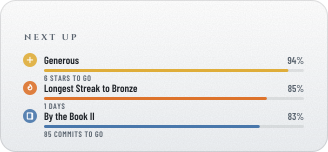</picture>

  <a href="https://github.com/tannergolden/markdown/blob/HEAD/docs/Catalogue.md#profile-commits"><picture><source media="(prefers-color-scheme: dark)" srcset="assets/trophies/commits.svg">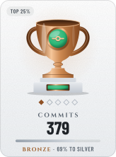</picture></a>
  <a href="https://github.com/tannergolden/markdown/blob/HEAD/docs/Catalogue.md#profile-repos"><picture><source media="(prefers-color-scheme: dark)" srcset="assets/trophies/repos.svg">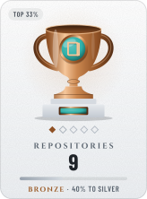</picture></a>
  <a href="https://github.com/tannergolden/markdown/blob/HEAD/docs/Catalogue.md#profile-streak"><picture><source media="(prefers-color-scheme: dark)" srcset="assets/trophies/streak.svg">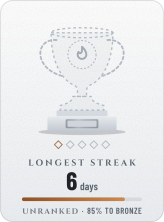</picture></a>
  <a href="https://github.com/tannergolden/markdown/blob/HEAD/docs/Catalogue.md#profile-followers"><picture><source media="(prefers-color-scheme: dark)" srcset="assets/trophies/followers.svg">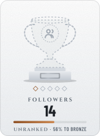</picture></a>
  <a href="https://github.com/tannergolden/markdown/blob/HEAD/docs/Catalogue.md#profile-pulls"><picture><source media="(prefers-color-scheme: dark)" srcset="assets/trophies/pulls.svg">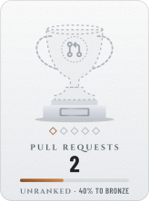</picture></a>

<b>Achievements</b> · 40 of 104 earned · next: Generous, 94%

<b>Milestones</b>

  <a href="https://github.com/tannergolden/markdown/blob/HEAD/docs/Catalogue.md#profile-century"><picture><source media="(prefers-color-scheme: dark)" srcset="assets/trophies/achievements/century.svg">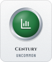</picture></a>
  <a href="https://github.com/tannergolden/markdown/blob/HEAD/docs/Catalogue.md#profile-landed"><picture><source media="(prefers-color-scheme: dark)" srcset="assets/trophies/achievements/landed.svg"></picture></a>
  <a href="https://github.com/tannergolden/markdown/blob/HEAD/docs/Catalogue.md#profile-shipped"><picture><source media="(prefers-color-scheme: dark)" srcset="assets/trophies/achievements/shipped.svg">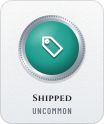</picture></a>
  <a href="https://github.com/tannergolden/markdown/blob/HEAD/docs/Catalogue.md#profile-first-light"><picture><source media="(prefers-color-scheme: dark)" srcset="assets/trophies/achievements/first-light.svg">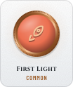</picture></a>
  <a href="https://github.com/tannergolden/markdown/blob/HEAD/docs/Catalogue.md#profile-hello-world"><picture><source media="(prefers-color-scheme: dark)" srcset="assets/trophies/achievements/hello-world.svg">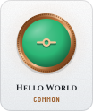</picture></a>
  <a href="https://github.com/tannergolden/markdown/blob/HEAD/docs/Catalogue.md#profile-opening-move"><picture><source media="(prefers-color-scheme: dark)" srcset="assets/trophies/achievements/opening-move.svg">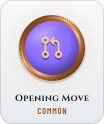</picture></a>
  <a href="https://github.com/tannergolden/markdown/blob/HEAD/docs/Catalogue.md#profile-veteran"><picture><source media="(prefers-color-scheme: dark)" srcset="assets/trophies/achievements/veteran.svg"></picture></a>
  <a href="https://github.com/tannergolden/markdown/blob/HEAD/docs/Catalogue.md#profile-polyglot"><picture><source media="(prefers-color-scheme: dark)" srcset="assets/trophies/achievements/polyglot.svg">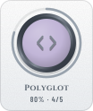</picture></a>
  <a href="https://github.com/tannergolden/markdown/blob/HEAD/docs/Catalogue.md#profile-branching-out"><picture><source media="(prefers-color-scheme: dark)" srcset="assets/trophies/achievements/branching-out.svg"></picture></a>
  <a href="https://github.com/tannergolden/markdown/blob/HEAD/docs/Catalogue.md#profile-shipwright"><picture><source media="(prefers-color-scheme: dark)" srcset="assets/trophies/achievements/shipwright.svg">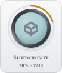</picture></a>
  <a href="https://github.com/tannergolden/markdown/blob/HEAD/docs/Catalogue.md#profile-monolith"><picture><source media="(prefers-color-scheme: dark)" srcset="assets/trophies/achievements/monolith.svg">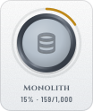</picture></a>
  <a href="https://github.com/tannergolden/markdown/blob/HEAD/docs/Catalogue.md#profile-bug-hunter"><picture><source media="(prefers-color-scheme: dark)" srcset="assets/trophies/achievements/bug-hunter.svg">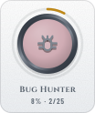</picture></a>
  <a href="https://github.com/tannergolden/markdown/blob/HEAD/docs/Catalogue.md#profile-merge-master"><picture><source media="(prefers-color-scheme: dark)" srcset="assets/trophies/achievements/merge-master.svg"></picture></a>
  <a href="https://github.com/tannergolden/markdown/blob/HEAD/docs/Catalogue.md#profile-closer"><picture><source media="(prefers-color-scheme: dark)" srcset="assets/trophies/achievements/closer.svg">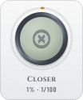</picture></a>
  <a href="https://github.com/tannergolden/markdown/blob/HEAD/docs/Catalogue.md#profile-fan-club"><picture><source media="(prefers-color-scheme: dark)" srcset="assets/trophies/achievements/fan-club.svg"></picture></a>
  <a href="https://github.com/tannergolden/markdown/blob/HEAD/docs/Catalogue.md#profile-forked"><picture><source media="(prefers-color-scheme: dark)" srcset="assets/trophies/achievements/forked.svg">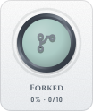</picture></a>
  <a href="https://github.com/tannergolden/markdown/blob/HEAD/docs/Catalogue.md#profile-long-haul"><picture><source media="(prefers-color-scheme: dark)" srcset="assets/trophies/achievements/long-haul.svg">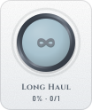</picture></a>
  <a href="https://github.com/tannergolden/markdown/blob/HEAD/docs/Catalogue.md#profile-second-opinion"><picture><source media="(prefers-color-scheme: dark)" srcset="assets/trophies/achievements/second-opinion.svg"></picture></a>
  <a href="https://github.com/tannergolden/markdown/blob/HEAD/docs/Catalogue.md#profile-stargazer"><picture><source media="(prefers-color-scheme: dark)" srcset="assets/trophies/achievements/stargazer.svg">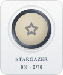</picture></a>
  <a href="https://github.com/tannergolden/markdown/blob/HEAD/docs/Catalogue.md#profile-ticket"><picture><source media="(prefers-color-scheme: dark)" srcset="assets/trophies/achievements/ticket.svg"></picture></a>
  <a href="https://github.com/tannergolden/markdown/blob/HEAD/docs/Catalogue.md#profile-watched"><picture><source media="(prefers-color-scheme: dark)" srcset="assets/trophies/achievements/watched.svg"></picture></a>

<b>Craft</b>

  <a href="https://github.com/tannergolden/markdown/blob/HEAD/docs/Catalogue.md#profile-by-the-book"><picture><source media="(prefers-color-scheme: dark)" srcset="assets/trophies/achievements/by-the-book.svg"></picture></a>
  <a href="https://github.com/tannergolden/markdown/blob/HEAD/docs/Catalogue.md#profile-duet"><picture><source media="(prefers-color-scheme: dark)" srcset="assets/trophies/achievements/duet.svg"></picture></a>
  <a href="https://github.com/tannergolden/markdown/blob/HEAD/docs/Catalogue.md#profile-green-machine"><picture><source media="(prefers-color-scheme: dark)" srcset="assets/trophies/achievements/green-machine.svg"></picture></a>
  <a href="https://github.com/tannergolden/markdown/blob/HEAD/docs/Catalogue.md#profile-scribe"><picture><source media="(prefers-color-scheme: dark)" srcset="assets/trophies/achievements/scribe.svg"></picture></a>
  <a href="https://github.com/tannergolden/markdown/blob/HEAD/docs/Catalogue.md#profile-signed"><picture><source media="(prefers-color-scheme: dark)" srcset="assets/trophies/achievements/signed.svg"></picture></a>
  <a href="https://github.com/tannergolden/markdown/blob/HEAD/docs/Catalogue.md#profile-fixer"><picture><source media="(prefers-color-scheme: dark)" srcset="assets/trophies/achievements/fixer.svg"></picture></a>
  <a href="https://github.com/tannergolden/markdown/blob/HEAD/docs/Catalogue.md#profile-surgeon"><picture><source media="(prefers-color-scheme: dark)" srcset="assets/trophies/achievements/surgeon.svg"></picture></a>
  <a href="https://github.com/tannergolden/markdown/blob/HEAD/docs/Catalogue.md#profile-sweeping-change"><picture><source media="(prefers-color-scheme: dark)" srcset="assets/trophies/achievements/sweeping-change.svg">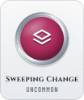</picture></a>
  <a href="https://github.com/tannergolden/markdown/blob/HEAD/docs/Catalogue.md#profile-heavy-lifter"><picture><source media="(prefers-color-scheme: dark)" srcset="assets/trophies/achievements/heavy-lifter.svg">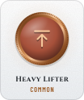</picture></a>
  <a href="https://github.com/tannergolden/markdown/blob/HEAD/docs/Catalogue.md#profile-tested"><picture><source media="(prefers-color-scheme: dark)" srcset="assets/trophies/achievements/tested.svg">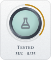</picture></a>
  <a href="https://github.com/tannergolden/markdown/blob/HEAD/docs/Catalogue.md#profile-well-maintained"><picture><source media="(prefers-color-scheme: dark)" srcset="assets/trophies/achievements/well-maintained.svg">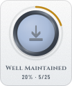</picture></a>
  <a href="https://github.com/tannergolden/markdown/blob/HEAD/docs/Catalogue.md#profile-gitmoji"><picture><source media="(prefers-color-scheme: dark)" srcset="assets/trophies/achievements/gitmoji.svg"></picture></a>
  <a href="https://github.com/tannergolden/markdown/blob/HEAD/docs/Catalogue.md#profile-toolsmith"><picture><source media="(prefers-color-scheme: dark)" srcset="assets/trophies/achievements/toolsmith.svg">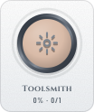</picture></a>
  <a href="https://github.com/tannergolden/markdown/blob/HEAD/docs/Catalogue.md#profile-undo"><picture><source media="(prefers-color-scheme: dark)" srcset="assets/trophies/achievements/undo.svg"></picture></a>

<b>Rhythm</b>

  <a href="https://github.com/tannergolden/markdown/blob/HEAD/docs/Catalogue.md#profile-marathon-day"><picture><source media="(prefers-color-scheme: dark)" srcset="assets/trophies/achievements/marathon-day.svg"></picture></a>
  <a href="https://github.com/tannergolden/markdown/blob/HEAD/docs/Catalogue.md#profile-sprint"><picture><source media="(prefers-color-scheme: dark)" srcset="assets/trophies/achievements/sprint.svg">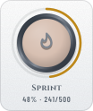</picture></a>
  <a href="https://github.com/tannergolden/markdown/blob/HEAD/docs/Catalogue.md#profile-big-week"><picture><source media="(prefers-color-scheme: dark)" srcset="assets/trophies/achievements/big-week.svg"></picture></a>
  <a href="https://github.com/tannergolden/markdown/blob/HEAD/docs/Catalogue.md#profile-night-owl"><picture><source media="(prefers-color-scheme: dark)" srcset="assets/trophies/achievements/night-owl.svg">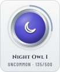</picture></a>
  <a href="https://github.com/tannergolden/markdown/blob/HEAD/docs/Catalogue.md#profile-comeback"><picture><source media="(prefers-color-scheme: dark)" srcset="assets/trophies/achievements/comeback.svg">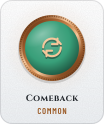</picture></a>
  <a href="https://github.com/tannergolden/markdown/blob/HEAD/docs/Catalogue.md#profile-long-game"><picture><source media="(prefers-color-scheme: dark)" srcset="assets/trophies/achievements/long-game.svg">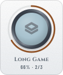</picture></a>
  <a href="https://github.com/tannergolden/markdown/blob/HEAD/docs/Catalogue.md#profile-lunch-break"><picture><source media="(prefers-color-scheme: dark)" srcset="assets/trophies/achievements/lunch-break.svg"></picture></a>
  <a href="https://github.com/tannergolden/markdown/blob/HEAD/docs/Catalogue.md#profile-early-bird"><picture><source media="(prefers-color-scheme: dark)" srcset="assets/trophies/achievements/early-bird.svg">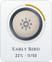</picture></a>
  <a href="https://github.com/tannergolden/markdown/blob/HEAD/docs/Catalogue.md#profile-weekender"><picture><source media="(prefers-color-scheme: dark)" srcset="assets/trophies/achievements/weekender.svg">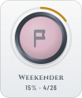</picture></a>
  <a href="https://github.com/tannergolden/markdown/blob/HEAD/docs/Catalogue.md#profile-weekday-warrior"><picture><source media="(prefers-color-scheme: dark)" srcset="assets/trophies/achievements/weekday-warrior.svg">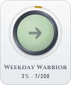</picture></a>
  <a href="https://github.com/tannergolden/markdown/blob/HEAD/docs/Catalogue.md#profile-year-of-code"><picture><source media="(prefers-color-scheme: dark)" srcset="assets/trophies/achievements/year-of-code.svg"></picture></a>
  <a href="https://github.com/tannergolden/markdown/blob/HEAD/docs/Catalogue.md#profile-four-seasons"><picture><source media="(prefers-color-scheme: dark)" srcset="assets/trophies/achievements/four-seasons.svg"></picture></a>
  <a href="https://github.com/tannergolden/markdown/blob/HEAD/docs/Catalogue.md#profile-friday-deploy"><picture><source media="(prefers-color-scheme: dark)" srcset="assets/trophies/achievements/friday-deploy.svg"></picture></a>
  <a href="https://github.com/tannergolden/markdown/blob/HEAD/docs/Catalogue.md#profile-perfect-month"><picture><source media="(prefers-color-scheme: dark)" srcset="assets/trophies/achievements/perfect-month.svg"></picture></a>

<b>Community</b>

  <a href="https://github.com/tannergolden/markdown/blob/HEAD/docs/Catalogue.md#profile-introduced"><picture><source media="(prefers-color-scheme: dark)" srcset="assets/trophies/achievements/introduced.svg"></picture></a>
  <a href="https://github.com/tannergolden/markdown/blob/HEAD/docs/Catalogue.md#profile-open-door"><picture><source media="(prefers-color-scheme: dark)" srcset="assets/trophies/achievements/open-door.svg"></picture></a>
  <a href="https://github.com/tannergolden/markdown/blob/HEAD/docs/Catalogue.md#profile-generous"><picture><source media="(prefers-color-scheme: dark)" srcset="assets/trophies/achievements/generous.svg">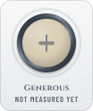</picture></a>
  <a href="https://github.com/tannergolden/markdown/blob/HEAD/docs/Catalogue.md#profile-curious"><picture><source media="(prefers-color-scheme: dark)" srcset="assets/trophies/achievements/curious.svg"></picture></a>
  <a href="https://github.com/tannergolden/markdown/blob/HEAD/docs/Catalogue.md#profile-answer-key"><picture><source media="(prefers-color-scheme: dark)" srcset="assets/trophies/achievements/answer-key.svg"></picture></a>
  <a href="https://github.com/tannergolden/markdown/blob/HEAD/docs/Catalogue.md#profile-backed"><picture><source media="(prefers-color-scheme: dark)" srcset="assets/trophies/achievements/backed.svg"></picture></a>
  <a href="https://github.com/tannergolden/markdown/blob/HEAD/docs/Catalogue.md#profile-conversation-starter"><picture><source media="(prefers-color-scheme: dark)" srcset="assets/trophies/achievements/conversation-starter.svg"></picture></a>
  <a href="https://github.com/tannergolden/markdown/blob/HEAD/docs/Catalogue.md#profile-crew"><picture><source media="(prefers-color-scheme: dark)" srcset="assets/trophies/achievements/crew.svg">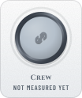</picture></a>
  <a href="https://github.com/tannergolden/markdown/blob/HEAD/docs/Catalogue.md#profile-founder"><picture><source media="(prefers-color-scheme: dark)" srcset="assets/trophies/achievements/founder.svg"></picture></a>
  <a href="https://github.com/tannergolden/markdown/blob/HEAD/docs/Catalogue.md#profile-gist-keeper"><picture><source media="(prefers-color-scheme: dark)" srcset="assets/trophies/achievements/gist-keeper.svg"></picture></a>
  <a href="https://github.com/tannergolden/markdown/blob/HEAD/docs/Catalogue.md#profile-green-light"><picture><source media="(prefers-color-scheme: dark)" srcset="assets/trophies/achievements/green-light.svg">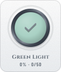</picture></a>
  <a href="https://github.com/tannergolden/markdown/blob/HEAD/docs/Catalogue.md#profile-patron"><picture><source media="(prefers-color-scheme: dark)" srcset="assets/trophies/achievements/patron.svg"></picture></a>
  <a href="https://github.com/tannergolden/markdown/blob/HEAD/docs/Catalogue.md#profile-planner"><picture><source media="(prefers-color-scheme: dark)" srcset="assets/trophies/achievements/planner.svg"></picture></a>
  <a href="https://github.com/tannergolden/markdown/blob/HEAD/docs/Catalogue.md#profile-red-pen"><picture><source media="(prefers-color-scheme: dark)" srcset="assets/trophies/achievements/red-pen.svg">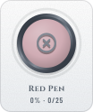</picture></a>
  <a href="https://github.com/tannergolden/markdown/blob/HEAD/docs/Catalogue.md#profile-registry"><picture><source media="(prefers-color-scheme: dark)" srcset="assets/trophies/achievements/registry.svg"></picture></a>
  <a href="https://github.com/tannergolden/markdown/blob/HEAD/docs/Catalogue.md#profile-reporter"><picture><source media="(prefers-color-scheme: dark)" srcset="assets/trophies/achievements/reporter.svg"></picture></a>
  <a href="https://github.com/tannergolden/markdown/blob/HEAD/docs/Catalogue.md#profile-roundtable"><picture><source media="(prefers-color-scheme: dark)" srcset="assets/trophies/achievements/roundtable.svg">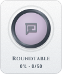</picture></a>
  <a href="https://github.com/tannergolden/markdown/blob/HEAD/docs/Catalogue.md#profile-second-pair-of-eyes"><picture><source media="(prefers-color-scheme: dark)" srcset="assets/trophies/achievements/second-pair-of-eyes.svg">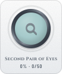</picture></a>
  <a href="https://github.com/tannergolden/markdown/blob/HEAD/docs/Catalogue.md#profile-team-player"><picture><source media="(prefers-color-scheme: dark)" srcset="assets/trophies/achievements/team-player.svg">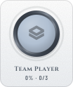</picture></a>
  <a href="https://github.com/tannergolden/markdown/blob/HEAD/docs/Catalogue.md#profile-upstream"><picture><source media="(prefers-color-scheme: dark)" srcset="assets/trophies/achievements/upstream.svg"></picture></a>
  <a href="https://github.com/tannergolden/markdown/blob/HEAD/docs/Catalogue.md#profile-voice"><picture><source media="(prefers-color-scheme: dark)" srcset="assets/trophies/achievements/voice.svg"></picture></a>

<b>Housekeeping</b>

  <a href="https://github.com/tannergolden/markdown/blob/HEAD/docs/Catalogue.md#profile-gatekeeper"><picture><source media="(prefers-color-scheme: dark)" srcset="assets/trophies/achievements/gatekeeper.svg"></picture></a>
  <a href="https://github.com/tannergolden/markdown/blob/HEAD/docs/Catalogue.md#profile-locksmith"><picture><source media="(prefers-color-scheme: dark)" srcset="assets/trophies/achievements/locksmith.svg"></picture></a>
  <a href="https://github.com/tannergolden/markdown/blob/HEAD/docs/Catalogue.md#profile-auto-pilot"><picture><source media="(prefers-color-scheme: dark)" srcset="assets/trophies/achievements/auto-pilot.svg"></picture></a>
  <a href="https://github.com/tannergolden/markdown/blob/HEAD/docs/Catalogue.md#profile-blueprint"><picture><source media="(prefers-color-scheme: dark)" srcset="assets/trophies/achievements/blueprint.svg"></picture></a>
  <a href="https://github.com/tannergolden/markdown/blob/HEAD/docs/Catalogue.md#profile-form-filler"><picture><source media="(prefers-color-scheme: dark)" srcset="assets/trophies/achievements/form-filler.svg"></picture></a>
  <a href="https://github.com/tannergolden/markdown/blob/HEAD/docs/Catalogue.md#profile-house-rules"><picture><source media="(prefers-color-scheme: dark)" srcset="assets/trophies/achievements/house-rules.svg"></picture></a>
  <a href="https://github.com/tannergolden/markdown/blob/HEAD/docs/Catalogue.md#profile-label-maker"><picture><source media="(prefers-color-scheme: dark)" srcset="assets/trophies/achievements/label-maker.svg"></picture></a>
  <a href="https://github.com/tannergolden/markdown/blob/HEAD/docs/Catalogue.md#profile-town-hall"><picture><source media="(prefers-color-scheme: dark)" srcset="assets/trophies/achievements/town-hall.svg"></picture></a>
  <a href="https://github.com/tannergolden/markdown/blob/HEAD/docs/Catalogue.md#profile-welcome-mat"><picture><source media="(prefers-color-scheme: dark)" srcset="assets/trophies/achievements/welcome-mat.svg"></picture></a>
  <a href="https://github.com/tannergolden/markdown/blob/HEAD/docs/Catalogue.md#profile-curator"><picture><source media="(prefers-color-scheme: dark)" srcset="assets/trophies/achievements/curator.svg"></picture></a>
  <a href="https://github.com/tannergolden/markdown/blob/HEAD/docs/Catalogue.md#profile-documented"><picture><source media="(prefers-color-scheme: dark)" srcset="assets/trophies/achievements/documented.svg">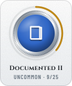</picture></a>
  <a href="https://github.com/tannergolden/markdown/blob/HEAD/docs/Catalogue.md#profile-licensed"><picture><source media="(prefers-color-scheme: dark)" srcset="assets/trophies/achievements/licensed.svg"></picture></a>
  <a href="https://github.com/tannergolden/markdown/blob/HEAD/docs/Catalogue.md#profile-front-door"><picture><source media="(prefers-color-scheme: dark)" srcset="assets/trophies/achievements/front-door.svg"></picture></a>
  <a href="https://github.com/tannergolden/markdown/blob/HEAD/docs/Catalogue.md#profile-semver"><picture><source media="(prefers-color-scheme: dark)" srcset="assets/trophies/achievements/semver.svg">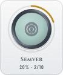</picture></a>
  <a href="https://github.com/tannergolden/markdown/blob/HEAD/docs/Catalogue.md#profile-open-hand"><picture><source media="(prefers-color-scheme: dark)" srcset="assets/trophies/achievements/open-hand.svg"></picture></a>
  <a href="https://github.com/tannergolden/markdown/blob/HEAD/docs/Catalogue.md#profile-packager"><picture><source media="(prefers-color-scheme: dark)" srcset="assets/trophies/achievements/packager.svg"></picture></a>
  <a href="https://github.com/tannergolden/markdown/blob/HEAD/docs/Catalogue.md#profile-roadmap"><picture><source media="(prefers-color-scheme: dark)" srcset="assets/trophies/achievements/roadmap.svg"></picture></a>
  <a href="https://github.com/tannergolden/markdown/blob/HEAD/docs/Catalogue.md#profile-tidy"><picture><source media="(prefers-color-scheme: dark)" srcset="assets/trophies/achievements/tidy.svg">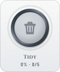</picture></a>

<b>Secret</b>

  <a href="https://github.com/tannergolden/markdown/blob/HEAD/docs/Catalogue.md#profile-ghost"><picture><source media="(prefers-color-scheme: dark)" srcset="assets/trophies/achievements/ghost.svg"></picture></a>
  <a href="https://github.com/tannergolden/markdown/blob/HEAD/docs/Catalogue.md#profile-constellation"><picture><source media="(prefers-color-scheme: dark)" srcset="assets/trophies/achievements/constellation.svg"></picture></a>
  <a href="https://github.com/tannergolden/markdown/blob/HEAD/docs/Catalogue.md#profile-friday-the-13th"><picture><source media="(prefers-color-scheme: dark)" srcset="assets/trophies/achievements/friday-the-13th.svg"></picture></a>
  <a href="https://github.com/tannergolden/markdown/blob/HEAD/docs/Catalogue.md#profile-full-house"><picture><source media="(prefers-color-scheme: dark)" srcset="assets/trophies/achievements/full-house.svg"></picture></a>
  <a href="https://github.com/tannergolden/markdown/blob/HEAD/docs/Catalogue.md#profile-green-wall"><picture><source media="(prefers-color-scheme: dark)" srcset="assets/trophies/achievements/green-wall.svg"></picture></a>
  <a href="https://github.com/tannergolden/markdown/blob/HEAD/docs/Catalogue.md#profile-homecoming"><picture><source media="(prefers-color-scheme: dark)" srcset="assets/trophies/achievements/homecoming.svg"></picture></a>
  <a href="https://github.com/tannergolden/markdown/blob/HEAD/docs/Catalogue.md#profile-inbox-zero"><picture><source media="(prefers-color-scheme: dark)" srcset="assets/trophies/achievements/inbox-zero.svg"></picture></a>
  <a href="https://github.com/tannergolden/markdown/blob/HEAD/docs/Catalogue.md#profile-leap-day"><picture><source media="(prefers-color-scheme: dark)" srcset="assets/trophies/achievements/leap-day.svg"></picture></a>
  <a href="https://github.com/tannergolden/markdown/blob/HEAD/docs/Catalogue.md#profile-midnight-oil"><picture><source media="(prefers-color-scheme: dark)" srcset="assets/trophies/achievements/midnight-oil.svg"></picture></a>
  <a href="https://github.com/tannergolden/markdown/blob/HEAD/docs/Catalogue.md#profile-new-year"><picture><source media="(prefers-color-scheme: dark)" srcset="assets/trophies/achievements/new-year.svg"></picture></a>
  <a href="https://github.com/tannergolden/markdown/blob/HEAD/docs/Catalogue.md#profile-round-number"><picture><source media="(prefers-color-scheme: dark)" srcset="assets/trophies/achievements/round-number.svg"></picture></a>
  <a href="https://github.com/tannergolden/markdown/blob/HEAD/docs/Catalogue.md#profile-the-answer"><picture><source media="(prefers-color-scheme: dark)" srcset="assets/trophies/achievements/the-answer.svg"></picture></a>

<b>Maker</b>

  <a href="https://github.com/tannergolden/markdown/blob/HEAD/docs/Catalogue.md#profile-badge-maker"><picture><source media="(prefers-color-scheme: dark)" srcset="assets/trophies/achievements/badge-maker.svg"></picture></a>
  <a href="https://github.com/tannergolden/markdown/blob/HEAD/docs/Catalogue.md#profile-pathfinder"><picture><source media="(prefers-color-scheme: dark)" srcset="assets/trophies/achievements/pathfinder.svg"></picture></a>
  <a href="https://github.com/tannergolden/markdown/blob/HEAD/docs/Catalogue.md#profile-standard-bearer"><picture><source media="(prefers-color-scheme: dark)" srcset="assets/trophies/achievements/standard-bearer.svg"></picture></a>
  <a href="https://github.com/tannergolden/markdown/blob/HEAD/docs/Catalogue.md#profile-trophy-maker"><picture><source media="(prefers-color-scheme: dark)" srcset="assets/trophies/achievements/trophy-maker.svg"></picture></a>

Refreshed daily by <a href="https://github.com/tannergolden/markdown">tannergolden/markdown</a> · Every trophy and achievement, what it is for and how to earn it: <a href="https://github.com/tannergolden/markdown/blob/HEAD/docs/Catalogue.md#profile">the catalogue</a>. Click any card for its entry.

<!-- markdown:trophies:end -->

---

## 📦 Latest Releases

The two repositories on this account that shipped most recently, each with its
version, the day it went out and the major tag a stub pins to follow it.
Superseded releases are pruned, so each one shown is its repository's current
release. Redrawn every Wednesday.

<!-- markdown:element:release-1:start -->
<a href="https://github.com/tannergolden/standards/releases/tag/v1.10.0">
<picture>
  <source media="(prefers-color-scheme: dark)" srcset="assets/elements/release-1-dark.svg">
  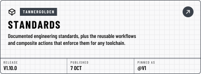
</picture>
</a>
<!-- markdown:element:release-1:end -->
<!-- markdown:element:release-2:start -->
<a href="https://github.com/tannergolden/markdown/releases/tag/v1.0.1">
<picture>
  <source media="(prefers-color-scheme: dark)" srcset="assets/elements/release-2-dark.svg">
  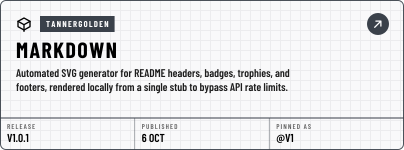
</picture>
</a>
<!-- markdown:element:release-2:end -->

---

## 📝 Field Notes

<!-- notes:start -->

> [!NOTE]
> **Professional · HTTP.** TLS 1.3 early data lets a returning client send its first request without waiting for the handshake, but an attacker can replay that data, so servers should accept only idempotent requests in it and can answer others with `425 Too Early`.

> [!TIP]
> **Beginner · Shell.** Insert a command's output into another command with `$(...)`, as in `echo "Backup from $(date +%F)"` or `cd "$(git rev-parse --show-toplevel)"` to reach the repository root.

> [!IMPORTANT]
> **End of life · [Ruby 3.3](https://endoflife.date/ruby).** Ruby 3.3 stops getting security fixes on 31 March 2027. Move to 4.0, the newest release.

> [!WARNING]
> **Advanced · Algorithms.** A Bloom filter's false-positive rate climbs steeply once it holds more items than it was sized for, and entries cannot be removed. Size it for the maximum item count and target rate, and rebuild it when you outgrow that.

> [!CAUTION]
> **Professional · Incidents.** Rehearse failing over to your disaster recovery region, and failing back, on a schedule. A first attempt made during a real disaster often stalls on a dependency nobody remembered.

Redrawn every Monday, at random, from 5,000 curated notes and five open data sources. Week 41 of 2026. Open data this week: endoflife.date.

<!-- notes:end -->

---

## 🌿 Good First Issue

<!-- markdown:element:issue-1:start -->
<a href="https://github.com/langgenius/dify/issues/43768">
<picture>
  <source media="(prefers-color-scheme: dark)" srcset="assets/elements/issue-1-dark.svg">
  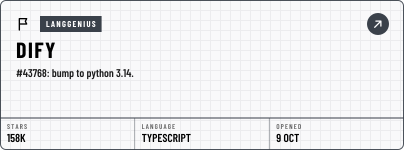
</picture>
</a>
<!-- markdown:element:issue-1:end -->
<!-- markdown:element:issue-2:start -->
<a href="https://github.com/tt-a1i/archify/issues/681">
<picture>
  <source media="(prefers-color-scheme: dark)" srcset="assets/elements/issue-2-dark.svg">
  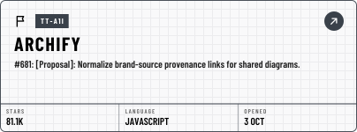
</picture>
</a>
<!-- markdown:element:issue-2:end -->

The newest good first issue from each of the two most-starred projects that opened one lately, still open and unclaimed. Redrawn every Friday.

---

<!-- markdown:footer:start -->

<a href="#top">
<picture>
  <source media="(max-width: 585px) and (prefers-color-scheme: dark)" srcset="assets/banners/footer-narrow-dark.svg">
  <source media="(max-width: 585px)" srcset="assets/banners/footer-narrow-day.svg">
  <source media="(prefers-color-scheme: dark)" srcset="assets/banners/footer-dark.svg">
  
</picture>
</a>

<a href="https://github.com/tannergolden?tab=repositories"><picture><source media="(prefers-color-scheme: dark)" srcset="assets/banners/link-repositories-dark.svg"></picture></a>
<a href="https://github.com/tannergolden/standards"><picture><source media="(prefers-color-scheme: dark)" srcset="assets/banners/link-standards-dark.svg"></picture></a>
<a href="https://github.com/tannergolden/path"><picture><source media="(prefers-color-scheme: dark)" srcset="assets/banners/link-golden-path-dark.svg"></picture></a>
<a href="https://github.com/tannergolden/markdown"><picture><source media="(prefers-color-scheme: dark)" srcset="assets/banners/link-markdown-dark.svg"></picture></a>

<!-- markdown:footer:end -->
